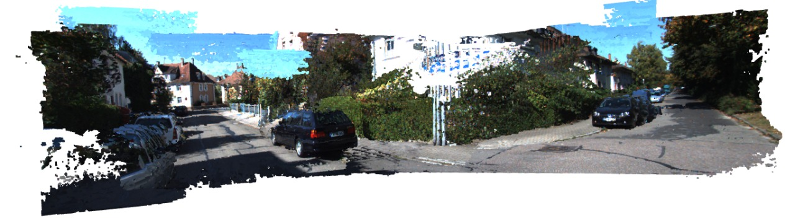

# Stereo Reconstruction and Non-Linear Optimization

## Overview

This project implements a pipeline for dense 3D reconstruction from stereo images and pose recovery using non-linear optimization. The main objectives are:

- Generate a dense 3D point cloud from rectified stereo image pairs.
- Register point clouds into a global world frame using ground truth poses.
- Visualize the reconstructed scene.
- Synthesize a virtual camera view and recover its pose using iterative optimization (PnP with Gauss-Newton).

## Dataset

The project uses a set of rectified and synchronized stereo image pairs (e.g., from a KITTI sequence), along with camera calibration data and ground truth poses for each stereo pair.

## Workflow

**1. Disparity Map Generation**
- Compute a disparity map for each stereo pair using OpenCV's StereoSGBM or a similar algorithm.
- The disparity map encodes the per-pixel horizontal shift between the left and right images, which is inversely proportional to depth.

**2. 3D Point Cloud Reconstruction**
- Convert disparity maps into depth maps using camera parameters and baseline distance.
- Generate colored 3D point clouds, ignoring pixels with invalid disparity values.
- Use Open3D or a similar library for point cloud storage and manipulation.

**3. Point Cloud Registration**
- Transform each point cloud into a global world frame using the provided ground truth poses.
- Accumulate all transformed point clouds to build a complete scene reconstruction.

**4. Visualization**
- Visualize the registered, colored point cloud to inspect the quality and completeness of the reconstruction.

**5. [Bonus] Algorithm Comparison**
- Optionally, compare different stereo matching algorithms (e.g., block matching, SGBM, Census Transform) and report observations on their performance.

**6. Virtual Camera Synthesis & Pose Recovery**
- Synthesize a new image from an arbitrary virtual camera pose using the reconstructed point cloud.
- Obtain 2D-3D correspondences between the synthesized image and the point cloud.
- Recover the virtual camera pose by minimizing the reprojection error using an iterative Perspective-n-Point (PnP) algorithm with Gauss-Newton optimization.
- Report the effects of different initialization choices and convergence behavior.

## Requirements

- Python 3.x
- OpenCV
- Open3D
- NumPy
- Jupyter Notebook

## Usage

1. Clone the repository and install dependencies.
2. Place the stereo image pairs, calibration data, and ground truth poses in the specified data directory.
3. Run the main notebook (`Project_2.ipynb`) to execute the reconstruction pipeline.
4. Visualize results and review observations in the notebook output.

## Key Concepts

- **Disparity Map:** Encodes the horizontal shift between corresponding pixels in stereo images; used to infer depth.
- **Point Cloud:** A set of 3D points representing the scene geometry, often colored for visualization.
- **Pose Registration:** Aligning multiple point clouds into a common coordinate frame using known camera poses.
- **PnP & Gauss-Newton:** Iterative optimization to recover camera pose from 2D-3D correspondences by minimizing reprojection error.

## References

- KITTI Dataset
- OpenCV Documentation
- Open3D Documentation

## Acknowledgements
This project is inspired by coursework and open-source examples on stereo vision and 3D reconstruction.